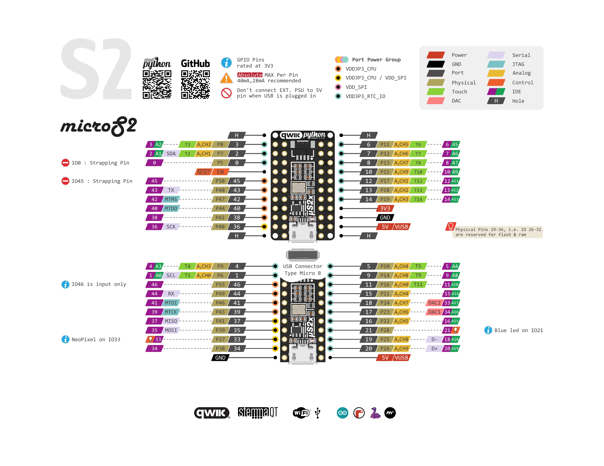

# microS2
Introducing the microS2 - An ESP32-S2 based development board in the size of an esp32 module!

**Features & Specifications**
 - 32-bit 240 MHz single-core processor
 - 16 MB SPI Flash
 - 8 MB extra PSRAM
 - 2.4 GHz Wi-Fi - 802.11b/g/n
 - High gain antenna
 - Low Quiescent Current
 - Neopixel (IO33)
 - Blue led (IO21)
 - All pins exposed
 - USB micro-B
 - QWIIC/STEMMA connector
 - Small form factor

**Code**
- [Arduino (beta)](https://github.com/espressif/arduino-esp32/tree/esp32s2)
- [ESP-IDF 3.3.4](https://github.com/espressif/esp-idf)
- [CircuitPython 6.0.0 beta-x](https://circuitpython.org/board/microdev_micro_s2/)

**Pinout**

