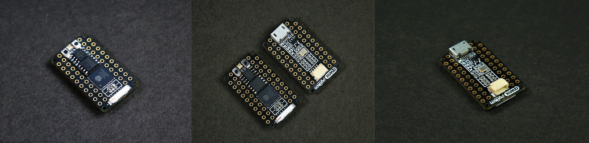
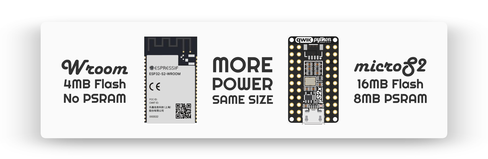
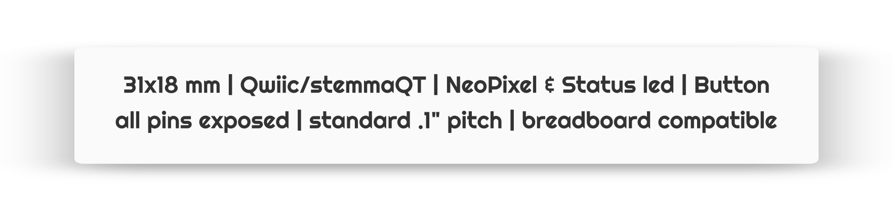
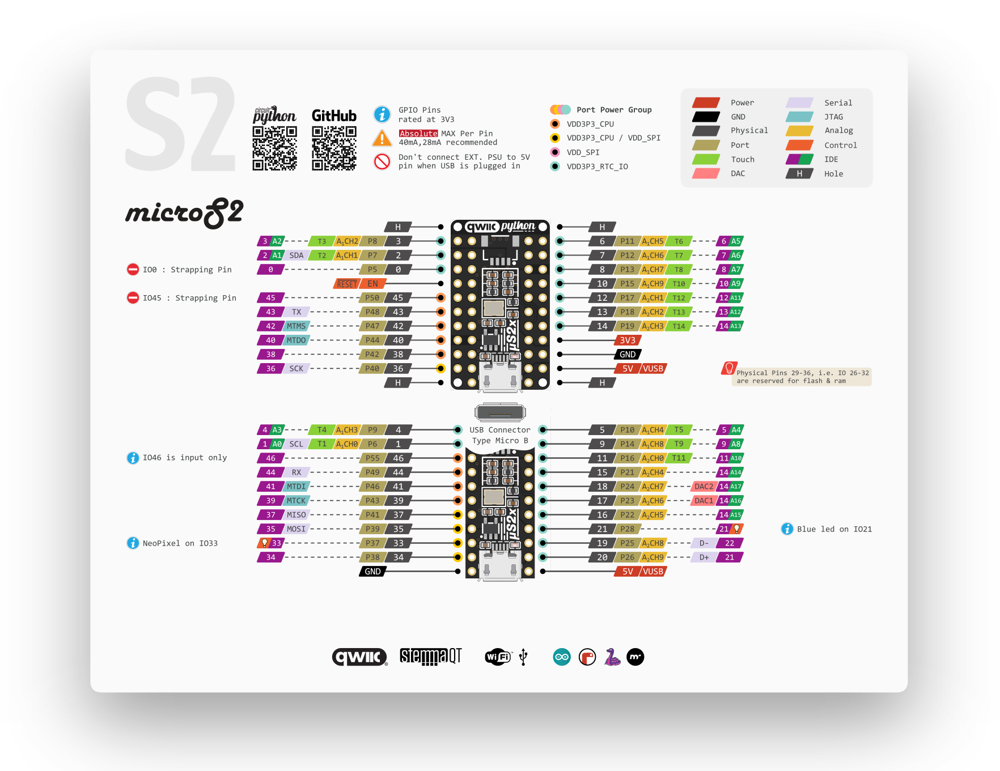

# microS2

Introducing the **microS2** - An ESP32-S2 based development board in the size of an esp32 module!

### Features & Specifications
 - 32-bit 240 MHz single-core processor
 - 16 MB SPI Flash
 - 8 MB extra PSRAM
 - 2.4 GHz Wi-Fi - 802.11b/g/n
 - High gain antenna
 - Low Quiescent Current
 - Neopixel (IO33)
 - Blue led (IO21)
 - All pins exposed
 - USB micro-B
 - QWIIC/STEMMA connector
 - Small form factor

### Software Support
- [Arduino](https://github.com/espressif/arduino-esp32/tree/esp32s2)
- [ESP-IDF](https://github.com/espressif/esp-idf)
- [CircuitPython](https://circuitpython.org/board/microdev_micro_s2/)
- [UF2 Bootloader](https://github.com/adafruit/tinyuf2/tree/master/ports/esp32s2#uf2-bootloader-application-for-esp32-s2)

